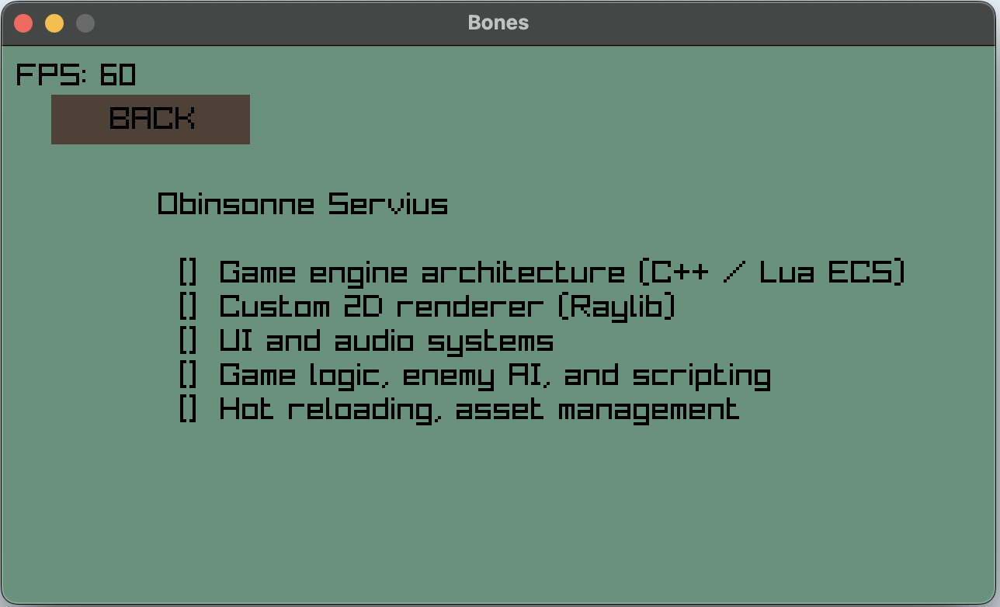
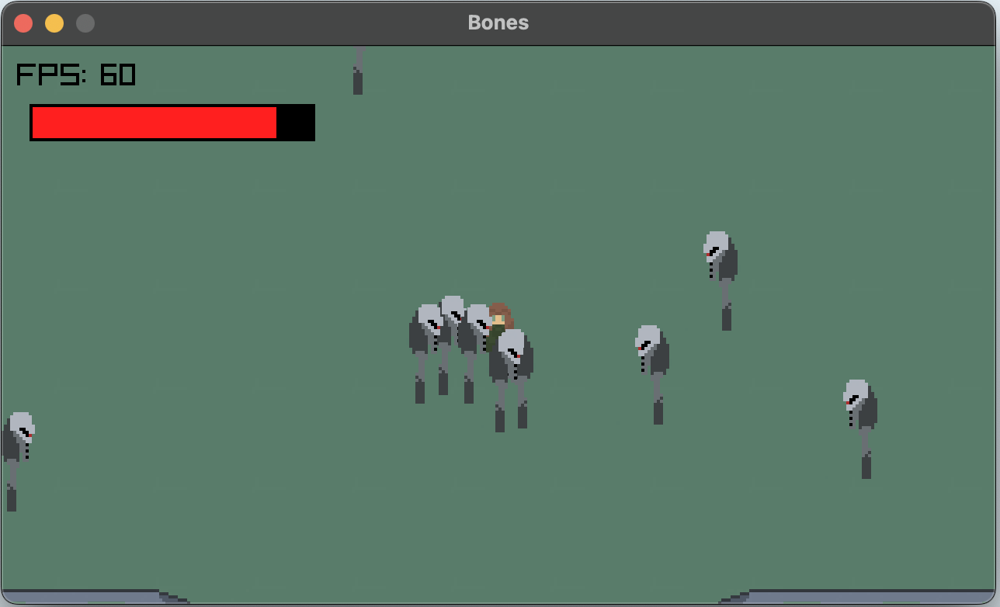
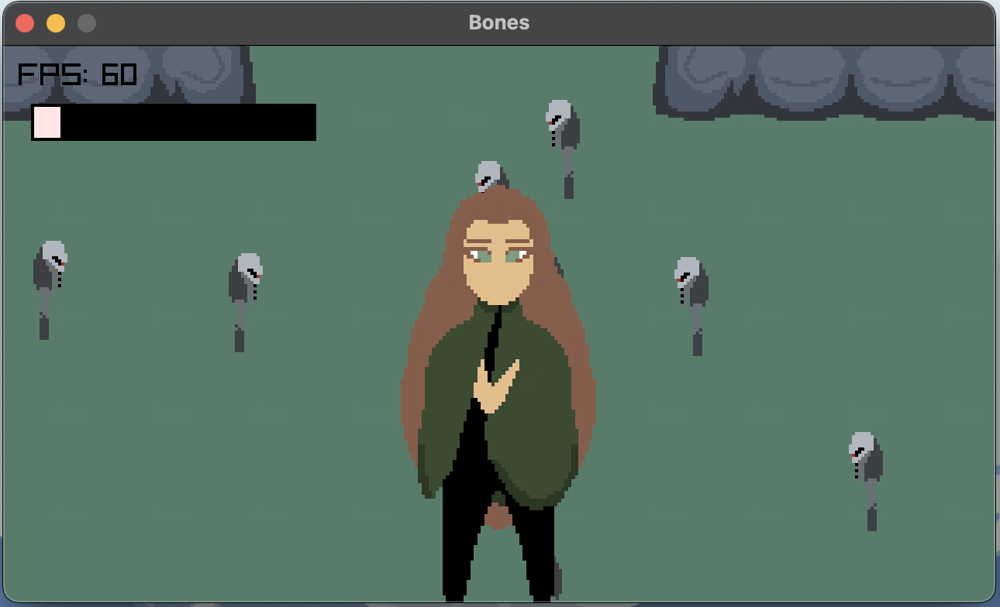

# bones
Entity Component System built using C++, Lua, and Raylib.
# bones

Entity Component System built using C++, Lua, and Raylib.

---

## 📸 Screenshots

| Main Menu | Credits | In-Game |
|----------|---------|--------|
|  |  |  |

| Special Screen | End Screen |
|----------------|------------|
|  |  |

---

## 🎥 Demo

https://github.com/obeecodes/bones/videos/demo.mov

---

## 🛠️ Build Instructions

```bash
# Clone and enter the project
git clone https://github.com/obeecodes/bones.git
cd bones

# Generate build files
cmake -B build

# Compile
cmake --build build
